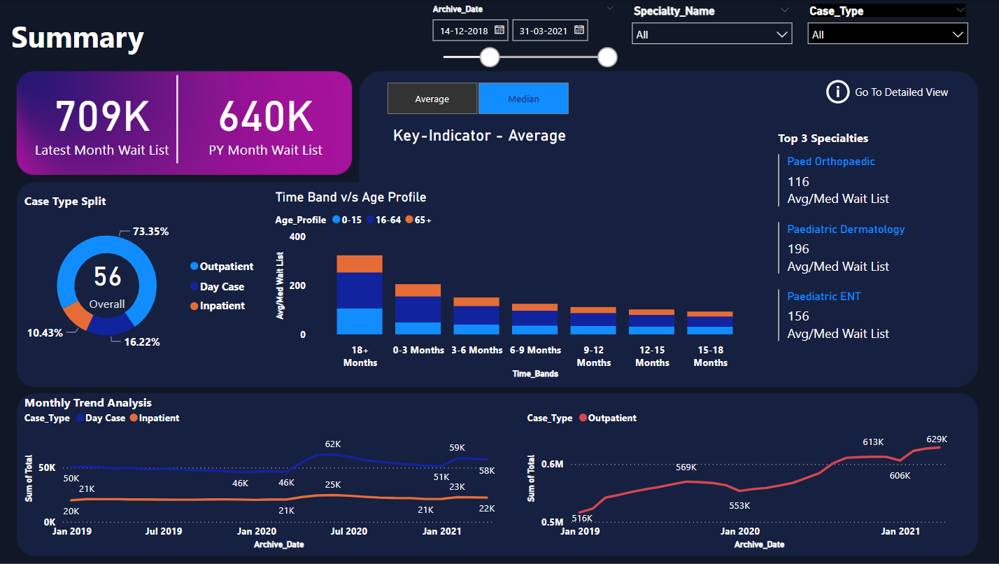
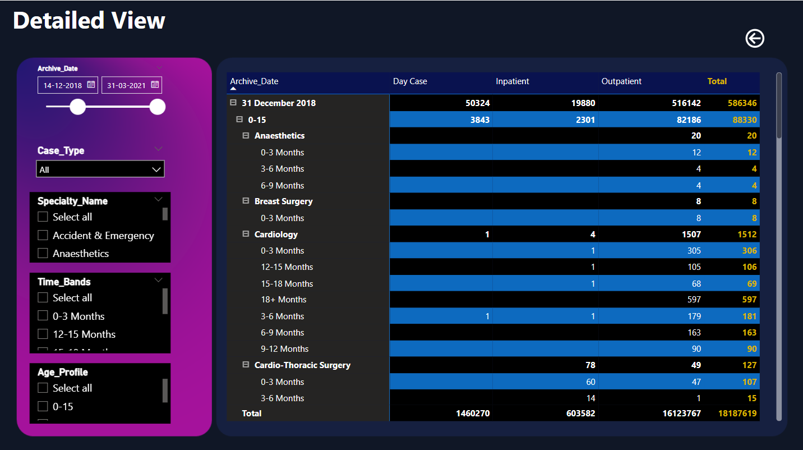

# HealthCare-PowerBI Dashboard & Report

A custom dashboard I created using Power BI! I used the Healthcare dataset for this endeavor, a fictional dataset that contains comprehensive data about Hospital Patients. 

The project's core objectives are to create a dynamic Business Intelligence solution using Power BI Desktop that connects and transforms raw data from CSV files, establishes a robust relational data model, employs Data Analysis Expressions (DAX) to calculate crucial KPIs, facilitates healthcare outcomes.

## Overview

### Dashboard Design
- Identify key performance indicators (KPIs).
- Design an intuitive, visually engaging dashboard.
- Implement interactive visualizations and filtering capabilities for detailed data exploration.

### Data Insights
- Deliver valuable insights to business stakeholders on the effectiveness of their sales strategies.
- Utilize various visualizations and charts to present data.
  
### Strategic Insights and Recommendations
- Aim to provide insights and actionable information to drive strategic decisions supporting the supermarket's goals for growth, efficiency, and customer satisfaction.

## Key Learnings
- Applied data analysis techniques, with a focus on time series analysis.
- Delivered valuable insights and accurate sales forecasts.
- Created interactive dashboards to drive business success.

## Screenshots

- Summary Page

- Detailed View

